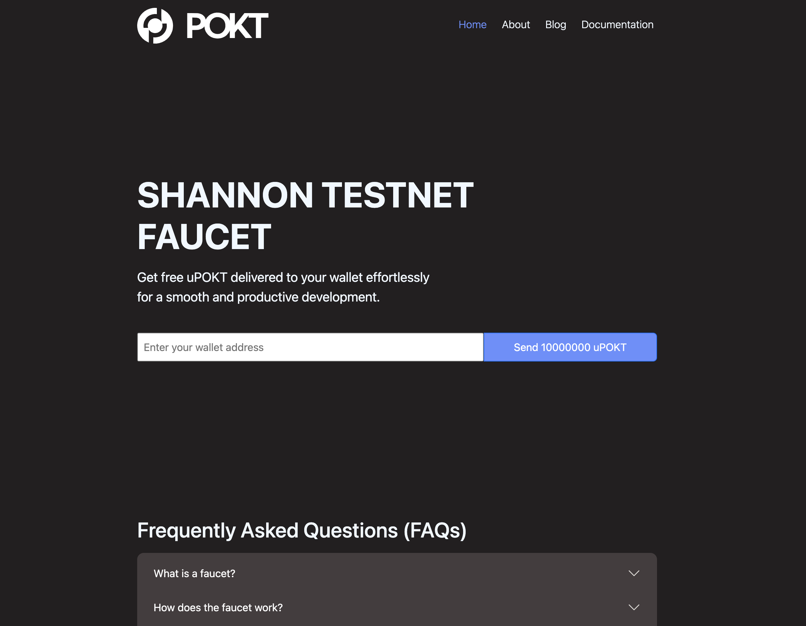

<div align="center">
  <a href="https://www.pokt.network">
    
  </a>
  <h1>Shannon Testnet Faucet</h1>
</div>

The Testnet Faucet is a web tool that allows users to obtain POKT for free on our test platform. Users simply need to provide their address to instantly receive uPOKT..

## Prerequisites

1. **Docker**: Ensure Docker is installed and running on your system.
2. **Environment Variables**: An `.env` file with the following **required** variables:
   - `mnemonic`
   - `rpcEndpoint`
   - `txAmount`
   - `txFeeAmount`
   - `txGasLimit`

**Note**: Make sure each variable is properly set with appropriate values in the `.env` file.

## Installing Docker and Docker Compose on Ubuntu Operating System

### Step 1: Install Docker

1. **Update the package database**:

   ```sh
   sudo apt-get update
   ```

2. **Install the necessary packages**:

   ```sh
   sudo apt-get install \
       apt-transport-https \
       ca-certificates \
       curl \
       gnupg \
       lsb-release
   ```

3. **Add Docker’s official GPG key**:

   ```sh
   curl -fsSL https://download.docker.com/linux/ubuntu/gpg | sudo gpg --dearmor -o /usr/share/keyrings/docker-archive-keyring.gpg
   ```

4. **Set up the stable repository**:

   ```sh
   echo \
   "deb [arch=amd64 signed-by=/usr/share/keyrings/docker-archive-keyring.gpg] https://download.docker.com/linux/ubuntu \
   $(lsb_release -cs) stable" | sudo tee /etc/apt/sources.list.d/docker.list > /dev/null
   ```

5. **Update the package database again**:

   ```sh
   sudo apt-get update
   ```

6. **Install Docker Engine**:

   ```sh
   sudo apt-get install docker-ce docker-ce-cli containerd.io docker-compose-plugin
   ```

7. **Verify that Docker Engine is installed correctly**:
   ```sh
   sudo docker run hello-world
   ```

### Step 2: Install Docker Compose

1. **Download the current stable release of Docker Compose**:

   ```sh
   sudo curl -L "https://github.com/docker/compose/releases/download/$(curl -s https://api.github.com/repos/docker/compose/releases/latest | grep -Po '"tag_name": "\K.*?(?=")')/docker-compose-$(uname -s)-$(uname -m)" -o /usr/local/bin/docker-compose
   ```

2. **Apply executable permissions to the binary**:

   ```sh
   sudo chmod +x /usr/local/bin/docker-compose
   ```

3. **Verify the installation**:
   ```sh
   docker-compose --version
   ```

### Step 3: Run Docker as a Non-Root User

1. **Create the `docker` group** (if it doesn't already exist):

   ```sh
   sudo groupadd docker
   ```

2. **Add your user to the `docker` group**:

   ```sh
   sudo usermod -aG docker $USER
   ```

3. **Log out and log back in so that your group membership is re-evaluated**.

4. **Verify that you can run `docker` commands without `sudo`**:

   ```sh
   docker run hello-world
   ```

Now, Docker and Docker Compose should be installed and ready to use on your system.

## Clone the Repository

```sh
git clone https://github.com/pokt-network/pocket-poktroll-faucet.git
cd pocket-poktroll-faucet
```

## Copy .env.example to .env

Make a copy of `.env.example` named `.env`.

```sh
cp .env.example .env
```

Open `.env` with your editor of choice to modify the file if necessary.

## Operating the Node

### Start

```sh
docker-compose up -d --build
```

### View logs

```sh
docker-compose logs -f --tail 10
```

### Stop

```sh
docker-compose down
```

### Restart

```sh
docker-compose restart
```

### Upgrade

Pull the latest updates from GitHub, and rebuild the container.

```sh
git pull
docker-compose up -d --build --force-recreate
```
