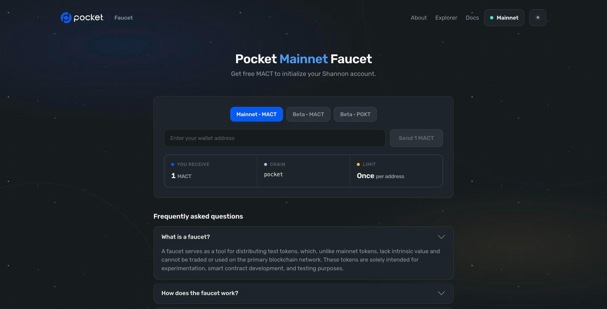

<div align="center">
  <a href="https://faucet.pocket.network">
    
  </a>
  <h1>Pocket Network Faucet</h1>
</div>

A web tool for claiming free tokens on Pocket Network. Enter an address, pick a
network, and the faucet sends the tokens.

One deployment serves every network defined in `chains.json`, and visitors choose
between them on the page. As configured here that is mainnet MACT, beta MACT and
beta POKT, each with its own endpoints, amount and limits.

## Prerequisites

1. **Docker**: Ensure Docker is installed and running on your system.
2. **Environment Variables**: An `.env` file holding the wallet mnemonics. See
   `.env.example`. Each network defined in `chains.json` names the variable that
   holds its own mnemonic, so mainnet and beta can use separate keys.
3. **Chain definitions**: `chains.json` defines every network the deployment
   serves. Each entry carries its own endpoints, token, amount and limits:
   - `id:` Route key and rate-limit namespace. Must be unique
   - `label:` Shown on the network picker
   - `chainId:` The chain ID as reported by the node
   - `chainType:` Shown in the page heading. `BETA` also shows the beta pill
   - `tokenName:` Token name shown to users, such as `POKT` or `MACT`
   - `rpcEndpoint:` CometBFT RPC endpoint, used to broadcast transactions
   - `apiEndpoint:` Cosmos REST API endpoint, used for balance checks. This is a
     different host from `rpcEndpoint`; the balance path does not exist on the RPC host
   - `bech32Prefix:` Human-readable address prefix
   - `txDenom:` Denomination sent to users (smallest unit)
   - `txAmount:` Amount in the smallest denomination
   - `tokenDecimals:` Decimal places between `txDenom` and `tokenName`. `6` turns
     upokt into POKT; `0` for a denom with no sub-unit, such as mact
   - `txFeeDenom:`, `txFeeAmount:`, `txGasLimit:`, `txTimeout:` Transaction settings
   - `initDenom:` Denom that marks an account as already initialized. When set,
     each address is served only once. Leave empty for a repeat-use faucet
   - `limitAddress:`, `limitIp:`, `limitHours:` Rate-limiting window and counts
   - `mnemonicEnv:` Name of the `.env` variable holding this network's mnemonic

**Note**: Make sure each variable is properly set with appropriate values in the `.env` file.

## Installing Docker and Docker Compose on Ubuntu Operating System

### Step 1: Install Docker

1. **Update the package database**:

   ```sh
   sudo apt-get update
   ```

2. **Install the necessary packages**:

   ```sh
   sudo apt-get install \
       apt-transport-https \
       ca-certificates \
       curl \
       gnupg \
       lsb-release
   ```

3. **Add Docker’s official GPG key**:

   ```sh
   curl -fsSL https://download.docker.com/linux/ubuntu/gpg | sudo gpg --dearmor -o /usr/share/keyrings/docker-archive-keyring.gpg
   ```

4. **Set up the stable repository**:

   ```sh
   echo \
   "deb [arch=amd64 signed-by=/usr/share/keyrings/docker-archive-keyring.gpg] https://download.docker.com/linux/ubuntu \
   $(lsb_release -cs) stable" | sudo tee /etc/apt/sources.list.d/docker.list > /dev/null
   ```

5. **Update the package database again**:

   ```sh
   sudo apt-get update
   ```

6. **Install Docker Engine**:

   ```sh
   sudo apt-get install docker-ce docker-ce-cli containerd.io docker-compose-plugin
   ```

7. **Verify that Docker Engine is installed correctly**:
   ```sh
   sudo docker run hello-world
   ```

### Step 2: Install Docker Compose

1. **Download the current stable release of Docker Compose**:

   ```sh
   sudo curl -L "https://github.com/docker/compose/releases/download/$(curl -s https://api.github.com/repos/docker/compose/releases/latest | grep -Po '"tag_name": "\K.*?(?=")')/docker-compose-$(uname -s)-$(uname -m)" -o /usr/local/bin/docker-compose
   ```

2. **Apply executable permissions to the binary**:

   ```sh
   sudo chmod +x /usr/local/bin/docker-compose
   ```

3. **Verify the installation**:
   ```sh
   docker-compose --version
   ```

### Step 3: Run Docker as a Non-Root User

1. **Create the `docker` group** (if it doesn't already exist):

   ```sh
   sudo groupadd docker
   ```

2. **Add your user to the `docker` group**:

   ```sh
   sudo usermod -aG docker $USER
   ```

3. **Log out and log back in so that your group membership is re-evaluated**.

4. **Verify that you can run `docker` commands without `sudo`**:

   ```sh
   docker run hello-world
   ```

Now, Docker and Docker Compose should be installed and ready to use on your system.

## Clone the Repository

```sh
git clone https://github.com/pokt-network/pocket-poktroll-faucet.git
cd pocket-poktroll-faucet
```

## Configure

Copy the example environment file and fill in the mnemonics:

```sh
cp .env.example .env
```

A single deployment serves every network listed in `chains.json`, and visitors
pick one from the network selector on the page. Edit `chains.json` to add,
remove or retune a network; no code change or extra deployment is needed.

Because one process holds every configured wallet, give each network its own
mnemonic variable rather than sharing one. That limits what a compromise of a
single network reaches. If you need stronger isolation than that, run mainnet as
its own deployment with a `chains.json` containing only the mainnet entry, and
point `chainsFile` at a different file for the other environments.

Open `.env` with your editor of choice to modify the file if necessary.

## Operations

| Endpoint | Port | Purpose |
| --- | --- | --- |
| `/healthz` | 8088 | Liveness. No crypto, no chain calls, so a chain outage never restarts the pod |
| `/readyz` | 8088 | Readiness. Returns 503 while the rate-limit database is not open |
| `/metrics` | 9464 | Prometheus. A separate listener, so it is not routable through the public ingress |

Liveness and readiness are deliberately different checks. The rate-limit
database takes an exclusive lock, so a pod that cannot open it must stop
receiving traffic rather than serve requests it cannot meter. In that state
`/send` fails closed and no tokens are sent.

Metrics worth alerting on:

- `faucet_wallet_balance{chain,denom}` — an empty faucet fails every request
  while looking healthy everywhere else. Gas runs out long before the
  distributed token does
- `faucet_wallet_balance_updated_seconds{chain}` — staleness, so a silently
  failing refresh is visible
- `faucet_sends_total{chain,outcome,reason}` and
  `faucet_rejections_total{chain,rule}`
- `faucet_broadcast_duration_seconds{chain,outcome}`
- `faucet_rpc_healthy{chain}` and `faucet_ratelimit_db_open`

### Running under Kubernetes

- `replicas: 1`, and `strategy: Recreate` rather than `RollingUpdate`. The
  rate-limit database takes an exclusive file lock, so a second pod crashloops
  rather than degrading, and a rolling update starts the new pod before the old
  one exits
- A PersistentVolumeClaim for `/usr/src/app/.faucet`. Without it every restart
  resets all quotas, which silently drops the once-per-address guarantee
- `fsGroup: 1000`. The image runs as uid 1000, and a PVC does not inherit the
  image's directory ownership. Without it the database cannot open, `/readyz`
  reports 503 and every request fails closed
- `readOnlyRootFilesystem: true` works. Nothing outside `.faucet` is written
- Set `trustProxy` to the number of proxies that append to `X-Forwarded-For`.
  Too low and a caller spoofs the header for unlimited quota; too high and every
  client shares one bucket. Each `/send` logs the raw header and the resolved
  IP so the value can be checked against a real request

## Building the image

Images are published to the GitHub Container Registry by the **Build and publish
image** workflow, which is triggered by hand from the Actions tab. Pick the
branch you want in the "Use workflow from" dropdown, so a branch build can be
deployed to beta while `main` stays untouched.

Every build is tagged with the branch name and with an immutable
`sha-<commit>` tag:

```
ghcr.io/pokt-network/pocket-poktroll-faucet:<branch>
ghcr.io/pokt-network/pocket-poktroll-faucet:sha-<commit>
```

Pin deployments to the `sha-` tag or the digest. Branch tags move, so a rollout
referencing one is not reproducible.

The workflow builds `linux/amd64` by default; select the multi-arch option if
the cluster runs arm64 nodes. Tests run first unless disabled, and "latest" is
only applied when explicitly requested.

Note the package is private on first publish. Make it public under the
repository's Packages settings, or give the cluster an `imagePullSecret`,
otherwise the pull fails with an authentication error.

A separate **CI** workflow runs the tests, a high-severity dependency audit, a
`chains.json` sanity check and a Docker build on every push and pull request. It
publishes nothing.

## Operating the Node

### Start

```sh
docker-compose up -d --build
```

### View logs

```sh
docker-compose logs -f --tail 10
```

### Stop

```sh
docker-compose down
```

### Restart

```sh
docker-compose restart
```

### Upgrade

Pull the latest updates from GitHub, and rebuild the container.

```sh
git pull
docker-compose up -d --build --force-recreate
```
